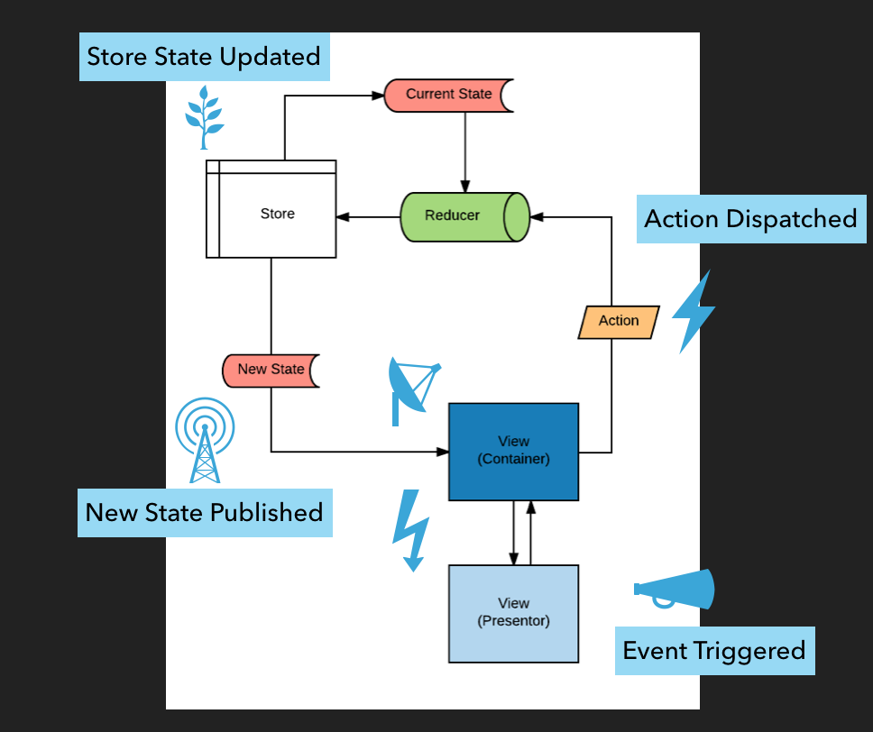

## Data Flow

`Redux` following Flux's principal on strict **unidirectional data flow**.

Having all the application data stored in a central store and all interactions following the same lifecycle pattern makes
the application logic more predictable and easier to understand.

1. An **action** is __dispatched__ to the store
2. The action flows through the **reducer/s** which create a __new state__ based on the __previous state__ and the dispatched **action**
3. The **store** is updated with new state and __publishes__ the new state to all the subscribers
4. Each subscriber performs any necessarily changes based on the updated state.
5. Any interactions would emit and event and start back at #1